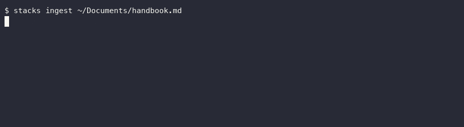

# stacks

On-device semantic search over your own files. Ask your Mac a question, get a grounded, cited answer -- nothing leaves the machine.



An on-device sequel to [finance-rag](https://github.com/rajanshxrma/finance-rag) (which asked the same kind of question over bank statements via OpenAI + Supabase pgvector) -- same RAG shape, re-engineered end to end for local files and zero cloud calls: Apple's built-in `NLEmbedding` instead of OpenAI embeddings, a local cosine-similarity index instead of pgvector, and the on-device Foundation Model via [langchain-apple-foundation-models](https://github.com/rajanshxrma/langchain-apple-foundation-models) instead of GPT.

## Install

```
pip install -e .
stacks ingest ~/Documents/some-folder
stacks ask "what was discussed in the Q3 planning meeting"
```

Requires macOS 26+, Apple Silicon. Handles `.pdf`, `.md`, `.txt` today (see Limitations).

## How it works

| | finance-rag (cloud) | stacks (on-device) |
|---|---|---|
| Embeddings | OpenAI `text-embedding-*` | `NLEmbedding.sentenceEmbedding` -- built into macOS since 11.0, zero downloads, zero beta dependency |
| Vector search | Supabase pgvector, `match_documents` RPC | Brute-force cosine similarity over numpy -- real at personal-file scale (thousands of chunks, not millions; see benchmarks), no reason to reach for a real vector DB |
| Generation | GPT via OpenAI chat completions | On-device Foundation Model, same "only answer from context, cite sources, admit when you don't know" discipline finance-rag already established |
| Storage | Supabase (cloud) | `~/.stacks/index.json`, `0600` permissions (owner read/write only -- this file holds real snippets of your own documents, treated like an SSH key, not left at default umask) |

## Three real bugs found during testing (and fixed)

**A Python truthiness bug that silently broke index isolation.** `Index` defines `__len__` (so `len(index)` works). Early code used `index = index or Index()` as the "use the passed index, or a default one" pattern throughout `ingest.py`/`retriever.py` -- but a freshly created, still-empty `Index` has `len() == 0`, which Python treats as falsy. `or` was silently discarding a validly-passed, isolated, empty index and replacing it with a brand-new default-path `Index()` reading `~/.stacks/index.json` -- meaning a fresh index was invisibly redirected to the real default file the moment before anything got added to it. Caught because query results were showing content from completely unrelated previous test runs and temp directories that had no business being there. Fixed: `index if index is not None else Index()` everywhere -- `is None` is the only correct check when a class defines `__len__`.

**Retrieval threshold too strict for the embedding model's real discrimination.** Measured directly: for the query "how many vacation days do employees get," the actually-relevant vacation-policy chunk scored 0.291 cosine similarity -- while a completely unrelated meeting-notes chunk (also markdown, also starts with a `#` header) scored *higher*, 0.322. A 0.3 cutoff produced a real false negative on a genuinely answerable question. Rather than chase a perfect numeric threshold (which doesn't really exist here -- the two scores are 0.03 apart and mean opposite things), the fix leans on the generator's existing "only answer from context, say so if it doesn't apply" grounding: lowered the default threshold to 0.2 so borderline-relevant chunks reach the model, and verified this doesn't reintroduce false positives -- a genuinely unrelated query (tested: "what is the capital of France" against docs about vacation policy and soup) still correctly returns zero results and the honest fallback.

**Personal file content deserves the same "don't linger" treatment as lantern's camera captures.** Same principle as [lantern](https://github.com/rajanshxrma/lantern)'s privacy fix, applied proactively here from the start rather than found after the fact: the index file is `0600`-permissioned and lives outside the repo (also `.gitignore`d as a second safeguard) -- real personal document snippets never get world-readable permissions or accidentally committed.

## Benchmarks (measured, this machine)

| | |
|---|---|
| Ingest | 3 files / 3 chunks in 0.18s (~0.06s/chunk) |
| Query latency | median 7.84s, range 3.92s-10.48s (dominated by on-device generation, not retrieval -- search itself is sub-100ms) |
| Answer accuracy | 3/3 correct keyword in answer, 3/3 correct source cited, on a 3-document test set spanning distinct topics |

Reproduce with `python3 scripts/eval_stacks.py`.

## Limitations

- Handles `.pdf`, `.md`, `.txt` -- no `.docx`, images, or other formats yet.
- Brute-force cosine search, not a real ANN index -- genuinely fine at personal-file scale (measured: sub-100ms search), would need reconsidering at a much larger corpus size.
- `NLEmbedding`'s semantic discrimination is real but not perfect at fine granularity (see the threshold bug above) -- retrieval leans on generation-time grounding to compensate, which works, but isn't the same as a more powerful (and heavier) embedding model getting the ranking right in the first place.
- No Spotlight/App Intents integration yet -- the original idea for this project mentioned surfacing results through Spotlight's entity schemas; that's Swift/App Intents territory this repo hasn't taken on, in keeping with the rest of this on-device stack staying pure Python (see [private-agent](https://github.com/rajanshxrma/private-agent)'s own precedent).

## License

MIT
